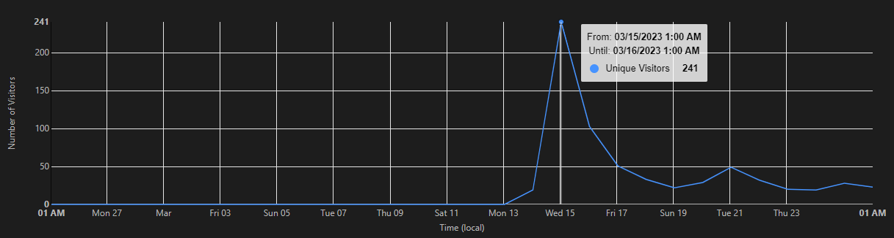

# 💸 Ein&shy;mal&shy;zah&shy;lung&shy;Zwei&shy;hun&shy;dert&shy;.de

Vielleicht suchst du [www.einmalzahlung200.de](https://www.einmalzahlung200.de/), bzw. [antrag.einmalzahlung200.de](https://antrag.einmalzahlung200.de/)?

Das ist tatsächlich die offizielle Domain des Bundesministeriums für Bildung und Forschung zur Beantragung der Energiepreispauschale in Höhe von 200€ gemäß dem [*EPPSG*](https://www.gesetze-im-internet.de/eppsg/).

Oder du suchst meine *Adlist für Pi-Hole*? 🕳 [https://&shy;www.&shy;ein&shy;mal&shy;zah&shy;lung&shy;zwei&shy;hun&shy;dert&shy;.de/bl-einmalzahlung.txt](https://www.einmalzahlungzweihundert.de/bl-einmalzahlung.txt)

---

## 📰 Aktuelles

Google hat zwei neue [Top-Level-Domains](https://de.wikipedia.org/wiki/Top-Level-Domain) ins Leben gerufen: [``.zip``](https://domains.google/tld/zip/) und [``.mov``](https://domains.google/tld/mov/).

Das beide sehr beliebte Dateiformate sind ist vielen bekannt. Gleichzeitig ist somit die Phishing- und Malware-Gefahr extrem groß. Daher ist ``.mov`` in meinem Pi-Hole geblacklistet, für ``.zip`` habe ich eine Adlist (siehe unten). Ab Version v5.17 von Pi-Hole ist es möglich auch nur TLD in Listen zu blockieren.

Bei [Github](https://github.com/trickest/zip/tree/main) gibt es ein Repo mit einer Liste mit bisher entdeckten ``.zip`` Domains und ich habe daraus eine Adlist für Pi-Hole erstellt.

---

### 🕳 Zip-Domain Adlist: [https://zip.einmalzahlungzweihundert.de/](https://zip.einmalzahlungzweihundert.de/)

### 🕳 Mov-Domain Adlist: [https://www.einmalzahlungzweihundert.de/bl-mov.txt](https://www.einmalzahlungzweihundert.de/bl-mov.txt)

### 🕳 Ein&shy;mal&shy;zah&shy;lung Adlist: [https://www.einmalzahlungzweihundert.de/bl-einmalzahlung.txt](https://www.einmalzahlungzweihundert.de/bl-einmalzahlung.txt)

---

## 🤔 Warum diese Seite?

Weil [Phishing](https://de.wikipedia.org/wiki/Phishing) ein ernstes Thema ist, habe ich diese Domain für ~6€ gekauft und diese Seite erstellt.

Damit niemand hier [Schabernack™](https://www.youtube.com/watch?v=8fYzpK2QqrY) treiben kann.

**100(!)** potentielle (registrierte) Phishing-Webseiten finden sich [hier](Phishing). Da ich diese Liste ohnehin angefertigt habe und
neulich Pi-Hole installiert habe, biete ich sie direkt mal als Adlist an.

---

### 🕳 Adlist für Pi-Hole: [https://www.einmalzahlungzweihundert.de/bl-einmalzahlung.txt](https://www.einmalzahlungzweihundert.de/bl-einmalzahlung.txt)

---

[Hier eine Seite](https://einmaIzahlung200.de/), auf der noch mehr Domains sind, die extra aus diesem Grund registriert wurden.

Immerhin wurden die Domains

- [1malzahlung200.de](https://1malzahlung200.de)
- [einmal-zahlung-200.de](https://einmal-zahlung-200.de/)

registriert mit einer Umleitung auf die echte Seite.

Andere ähnliche Seiten wie diese habe ich in meiner [Linksammlung mit "Einmalzahlungsseiten"](/Linksammlung) zusammengefasst.

---

### 📈 Aufrufzahlen dieser Seite

Was solche Seiten potentiell an Schaden hätten hervorrufen können, verdeutlichen die Aufrufzahlen dieser Webseite (einmalzahlungzweihundert.de).

Am 15.03.2023, also als die Antragsstellung freigeschaltet wurde, erreichte diese Webseite 241 Besucher.
Am darauffolgenden Tag waren 103 Besucher hier.
Und hier reden wir nicht von einem Tippfehler sondern von der ausformulierten Schreibweise *zweihundert*.

---

## 🏢 Beantragung

Mittlerweile hat es meine Uni geschafft, mir den Code zur Verfügung zu stellen (am Donnerstag, den 16.03.23), um die Einmalzahlung zu beantragen.

Den Antrag habe ich innerhalb von 5 Minuten stellen können (abgeschickt am Donnerstag, den 16.03.23, 12:06 Uhr) und habe den Bescheid am Freitag, den 17.03.23 um 00:54 Uhr, also nach etwa 13 Stunden erhalten.

Die Auszahlung kam am Dienstag, den 21.03.2023. Es dauerte also 3-4 Werktage, bis das Geld auf dem Konto war.

---

## ⚖️ Kritik

Hier zwei Seiten, die sich mit der generellen Thematik auseinandersetzen: [keinmalzahlung200.de](https://www.keinmalzahlung200.de/) und [einmalzahlung.wtf](https://einmalzahlung.wtf/).

Auf der offiziellen Seite gab es einen [Warteraum](Warteraum) 🤦

Zur Beantragung wird die [BundID](https://id.bund.de/de) benötigt.
Dies ist mit viel Kritik verbunden, da dieses Konto zwangsweise angelegt werden muss und persönliche Daten erhoben werden müssen, die in Augen vieler nicht notwendig wären. Dazu zähle ich mich auch.
Wenn die Hochschule o.ä. einen personalisierten Code mit PIN-Code generiert, ist es nicht mehr nötig die Identität erneut zu bestätigen.

Witzigerweise gibt es nun eine Seite: [Widerruf200.de](https://widerruf200.de/) auf der eine E-Mail generiert werden kann, um die BundID löschen zu lassen.

---

## [➡ Linksammlung mit "Einmalzahlungsseiten"](/Linksammlung)

---

## 📫 Kontakt

<hallo@einmalzahlungzweihundert.de>

---
